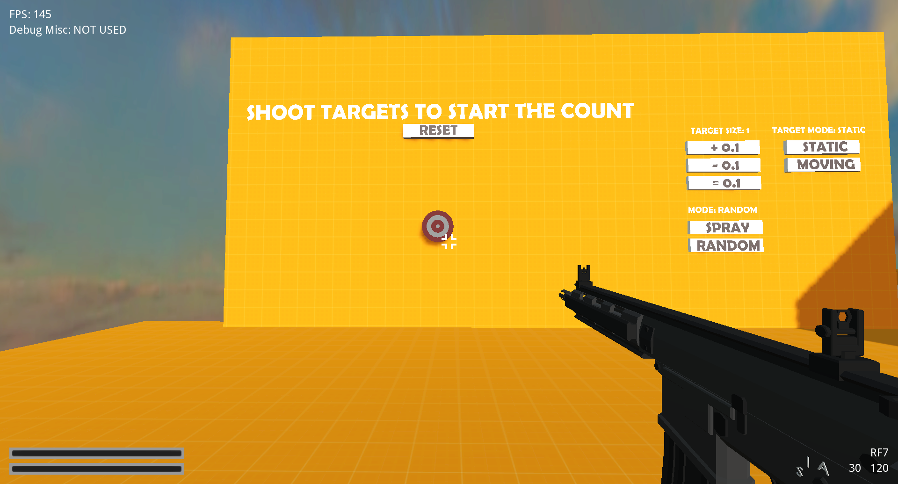

# The Solver Series

This is an open source project about the most versatile and fun **first person shooter**. There's already an implementation made in Godot Engine, but every single changes is based on the proposal inside of [`documents/PROPOSAL.md`](documents/PROPOSAL.md). Right now Tengku Izdihar the only one who is developing it on his free time, but you're welcome to contribute to the project.

NOTE FOR DEVELOPERS AND ENTHUSIAST: This project uses GIT-LFS, make sure your environment has it.

For any question, you can contact the project owner on matrix which is listed in https://tengkuizdihar.gitlab.io/contact/.

# Screenshot

This screenshot is last updated Sunday, March 20, 2022 8:46:54 PM GMT+07:00.

# Table Of Contents
- [The Solver Series](#the-solver-series)
- [Screenshot](#screenshot)
- [Table Of Contents](#table-of-contents)
  - [How to Contribute](#how-to-contribute)
  - [Roadmap](#roadmap)
    - [**Project Solver: Training** (CURRENT PHASE)](#project-solver-training-current-phase)
    - [**Project Solver: 1v1**](#project-solver-1v1)
    - [**Project Solver: 5v5**](#project-solver-5v5)
  - [Technical FAQ](#technical-faq)

## How to Contribute

Please read [CONTRIBUTING.md](CONTRIBUTING.md) for further assistance.

## Roadmap

Right now, the project does have milestones and an end game for the lifetime of the project. The endgame itself is not the end of the project, but rather the start of a new era where every single feature is implemented at least for a prototype. The project is called "Project Solver". "Project Solver" is a game that would evolve using the effort of the developer and or community, until the "perfect" or at least "usable" game could exist. Below is the list of games and their features.

### **Project Solver: Training** (CURRENT PHASE)

The first game in Project Solver that's all about aiming and training. It features customizations and offline capabilities for those who wants it. The game itself would focus on self improvement in the aiming department and will feature source-like movement as its main locomotion system. The features intended to be in the game is listed below.

- [x] Variety of target to shot at
- [x] Different weapons for different needs
  - [ ] Guns
    - [x] General Concepts
      - [x] Spray Pattern
      - [x] Recoil
      - [x] Inaccuracy (e.g. based on movement)
      - [x] Bullet Penetration
    - [x] Automatic Weapon (e.g. AK-47)
    - [x] Semi-Automatic Weapon (e.g. M9 Pistol)
    - [x] Scoped Semi-Automatic Weapon (e.g. Sniper Rifle)
    - [ ] Shotgun
  - [ ] Utilities
    - [x] General Concepts
      - [x] Right Click vs Left Click Throw
      - [x] Timed Detonation
    - [ ] Frag Grenade
    - [ ] Smoke Grenade
    - [ ] Flash Grenade
    - [ ] Incendiary Grenade
- [x] Training Methods
  - [x] Spray Practice
  - [x] Moving Target Practice
  - [x] Time Attack Practice (shoot target through corridor as fast as possible)
- [x] Movement system that's inspired by the Counter Strike series
  - [x] Crouch Jumping
  - [x] Bunny Hopping
  - [x] Air Strafing
  - [x] Counter Strafing
- [ ] Sound Design
- [ ] Animation
- [x] Light weight experience that's not only targeting the toaster, but also your beefed up $500,000, NASA made, super computer
- [ ] Easy to use UI customization that also includes an export and import function, for portability.
- [ ] Importing mouse sensitivity from other games
  - [ ] CSGO
  - [ ] Valorant
  - [ ] Call Of Duty

### **Project Solver: 1v1**

The second game in Project Solver that's all about 1v1 PVP. This game will include every single feature of The Aim Solver but now with a lot more variety of weapons and game modes. In multiplayer, the server will have the highest authority on what can or can't be done. This attributes will contribute to make the game much safer from cheaters and the like. The features intended to be in the game will be,

- [ ] Multiplayer that features 2 players fighting against each other.
- [ ] Replay features that's modular and can be copied by the user for save keeping purposes.
- [ ] Matchmaking based on the reputation and skill of the player.
- [ ] Statistics and data that the user can use to know which skill they need to improve upon.

### **Project Solver: 5v5**

The endgame of Project Solver that's all about 5v5 PVP. This game will also include every single feature of its predecessor and now with a working competitive mode that will clash two teams made out of 5 players doing their best to win.

- [ ] A better more robust matchmaking that's suited for a 10 player per match.
- [ ] A nicer and universal spectating system so other could use their client to do so.
- [ ] Delay based spectating for competitive matches.
- [ ] A more flexible and transparent skill assignments.

## Technical FAQ

- **I'm on NixOS and I can't run any game that's exported from Godot!**

  Run the game by going into root directory where the game is, and then use `steam-run <location of the game file>`. For example, `steam-run ./game.x86_64`.

  This of course happens because of how NixOS is structured and it seems like Godot does rely on some library such as `/lib64/ld-linux-x86-64.so.2` (in which every single 64 bit linux distribution should have).